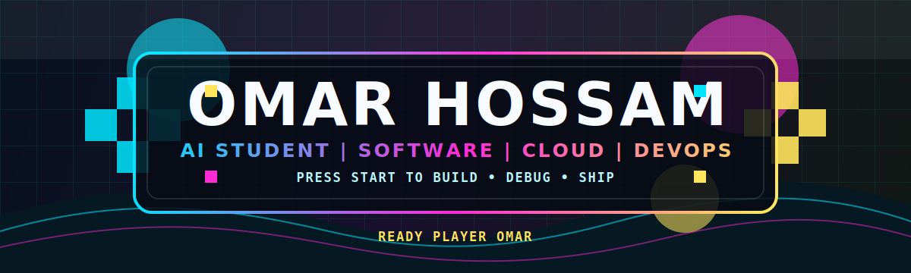
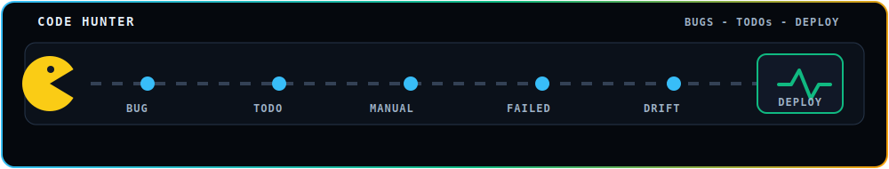

<p align="center">
  
</p>

<p align="center">
  
</p>

<p align="center">
  <a href="https://www.linkedin.com/in/omar-hossam-435224321/" title="LinkedIn">
    
  </a>
  &nbsp;&nbsp;
  <a href="https://www.facebook.com/omar.hossam.1048554" title="Facebook">
    
  </a>
  &nbsp;&nbsp;
  <a href="https://www.instagram.com/o_m_a_r_h_o_s_s_a_m/" title="Instagram">
    
  </a>
  &nbsp;&nbsp;
  <a href="https://github.com/omar-hossam0" title="GitHub">
    
  </a>
</p>

## About Me

```txt
PLAYER : Omar Hossam
CLASS  : Artificial Intelligence Student
BUILD  : Software Development | Cloud | DevOps
STYLE  : Learn by building, breaking, debugging, and shipping
MISSION: Turn ideas into useful systems and keep leveling up
```

I am an Artificial Intelligence student interested in software development, cloud, and DevOps. I like building projects, solving problems, and understanding how things work behind the scenes.

## Tech Arsenal

<p align="center">
  
</p>

## Current Focus

<table>
  <tr>
    <td width="50%">
      <strong>DevOps Foundations</strong><br />
      Practicing Linux basics, Bash scripting, Git workflows, containers, and CI/CD step by step.
    </td>
    <td width="50%">
      <strong>Cloud Direction</strong><br />
      Learning how local projects move into automated builds, Docker images, and AWS deployments.
    </td>
  </tr>
</table>

## Build Log

```txt
[01] Write small scripts that remove repeated manual work
[02] Containerize projects with Docker and understand the moving parts
[03] Build CI/CD habits with GitHub Actions and Jenkins basics
[04] Keep learning cloud deployment step by step, without skipping fundamentals
```

<p align="center">
  
</p>
