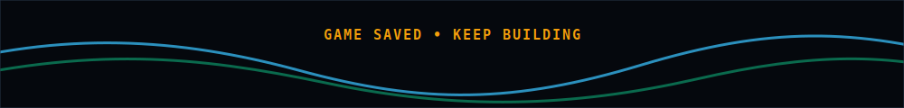

<p align="center">
  
</p>

<p align="center">
  
</p>

<p align="center">
  <a href="https://www.linkedin.com/in/omar-hossam-435224321/" title="LinkedIn">
    
  </a>
  &nbsp;&nbsp;
  <a href="https://www.facebook.com/omar.hossam.1048554" title="Facebook">
    
  </a>
  &nbsp;&nbsp;
  <a href="https://www.instagram.com/o_m_a_r_h_o_s_s_a_m/" title="Instagram">
    
  </a>
  &nbsp;&nbsp;
  <a href="https://github.com/omar-hossam0" title="GitHub">
    
  </a>
</p>

## About Me

```txt
PLAYER : Omar Hossam
CLASS  : Artificial Intelligence Student
BUILD  : Software Development | Cloud | DevOps
STYLE  : Learn by building, breaking, debugging, and shipping
MISSION: Turn ideas into useful systems and keep leveling up
```

I am an Artificial Intelligence student interested in software development, cloud, and DevOps. I like building projects, solving problems, and understanding how things work behind the scenes.

## Tech Arsenal

<table align="center">
  <tr>
    <td align="center" width="96">
      <br />
      <strong>Python</strong>
    </td>
    <td align="center" width="96">
      <br />
      <strong>JavaScript</strong>
    </td>
    <td align="center" width="96">
      <br />
      <strong>Docker</strong>
    </td>
    <td align="center" width="96">
      <br />
      <strong>Jenkins</strong>
    </td>
    <td align="center" width="96">
      <br />
      <strong>MongoDB</strong>
    </td>
  </tr>
  <tr>
    <td align="center" width="96">
      <br />
      <strong>AWS</strong>
    </td>
    <td align="center" width="96">
      <br />
      <strong>Actions</strong>
    </td>
    <td align="center" width="96">
      <br />
      <strong>Git</strong>
    </td>
    <td align="center" width="96">
      <br />
      <strong>GitHub</strong>
    </td>
    <td align="center" width="96">
      <br />
      <strong>VS Code</strong>
    </td>
  </tr>
</table>

## Current Focus

<table>
  <tr>
    <td width="50%">
      <strong>AI and Software</strong><br />
      Building stronger foundations in problem solving, clean code, and practical AI workflows.
    </td>
    <td width="50%">
      <strong>Cloud and DevOps</strong><br />
      Practicing Docker, CI/CD, automation, and deployment patterns that make projects easier to ship.
    </td>
  </tr>
</table>

## Build Log

```txt
[01] Study core AI concepts and practical software patterns
[02] Build projects that solve real problems
[03] Automate repeated work with scripts, CI, and containers
[04] Ship, learn, refactor, repeat
```

<p align="center">
  
</p>
